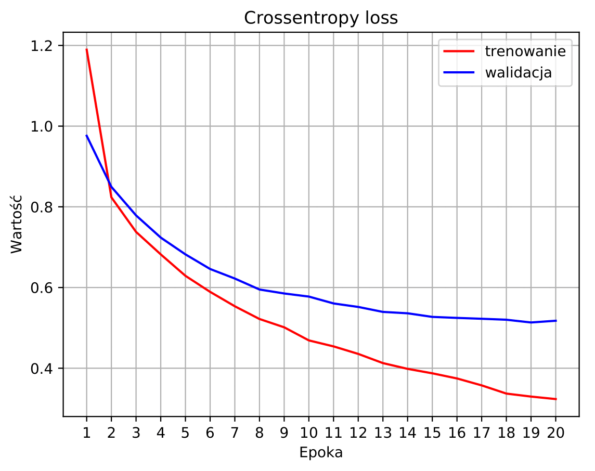
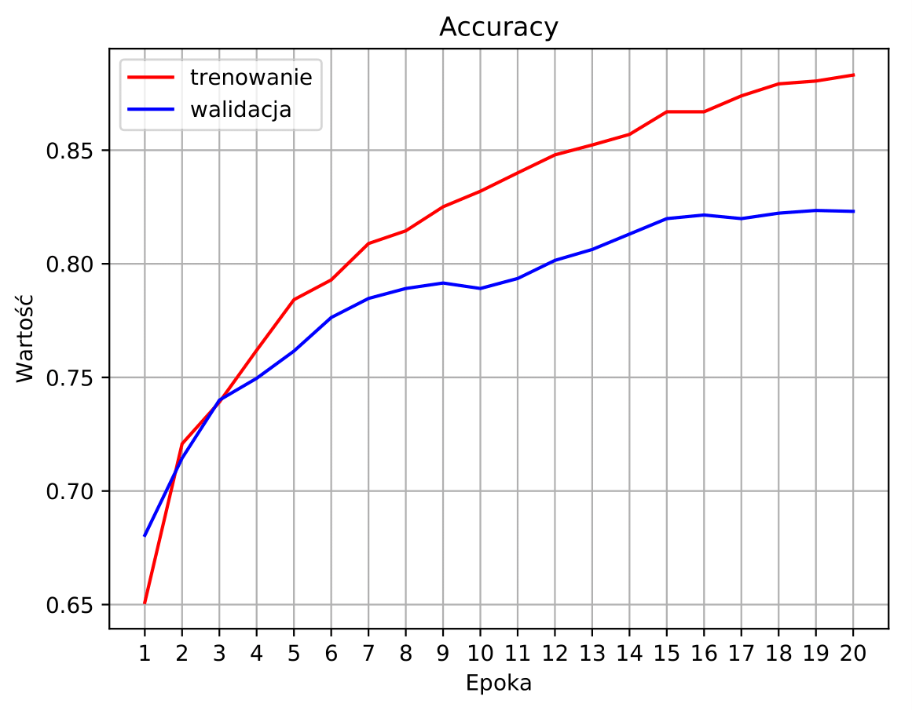
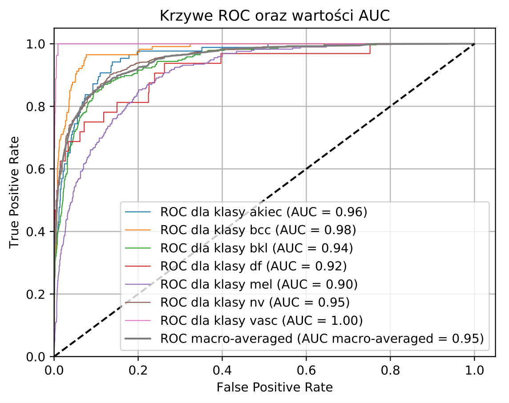
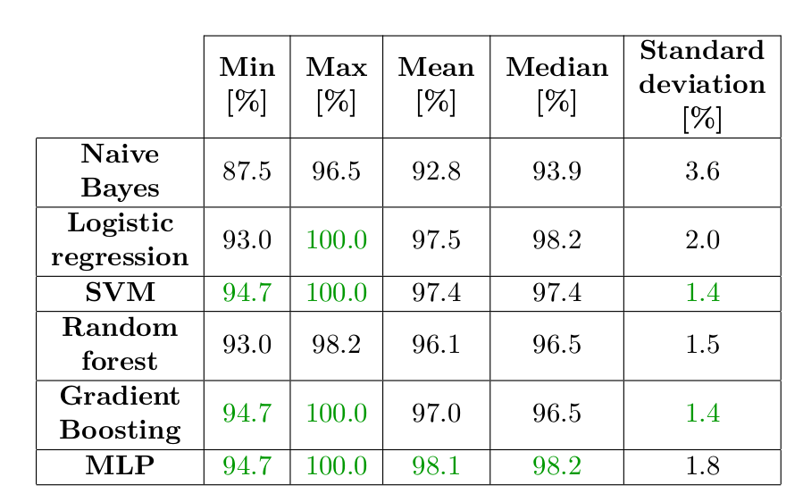
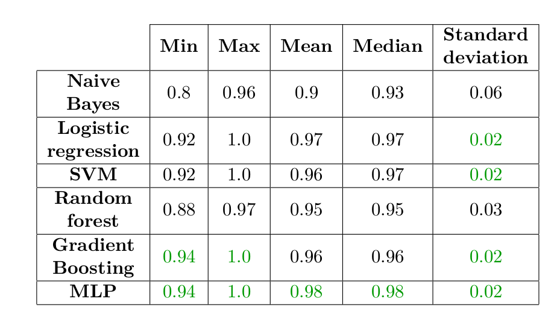

Models for "*Multimodal machine learning system for medical application*" \
Info about the system: https://github.com/imarkiew/Multimodal-ML-System-Server

The system was presented in the context of two types of data:

1. Skin lesions - 7 classes, image classification using a modified Xception neural network (Keras & Tensorflow) \
https://dataverse.harvard.edu/dataset.xhtml?persistentId=doi:10.7910/DVN/DBW86T \
The data set has been divided into training (75 %) and validation (25 %) sets. For training set data augmentation was used.

**Losses for training(red), validation(blue) and 20 epochs**

**Accuracies for training(red), validation(blue) and 20 epochs**

Results obtained for the validation set at the end of learning: accuracy = 82.3 %, F_1 macro = 0.66

**ROC curves for validation set**

**Confusion matrix for validation set**

2. Breast cancer - 2 classes, record classification using several models from scikit & xgboost \
https://archive.ics.uci.edu/ml/datasets/Breast+Cancer+Wisconsin+%28Diagnostic%29 \
The data set has been divided into training (80 %) and validation (20 %) sets

**Statistics for validation sets for accuracies. The best results in a given column are marked in green.**

**Statistics for validation sets for F_1 macro scores. The best results in a given column are marked in green.**

MLP was chosen as the final model.